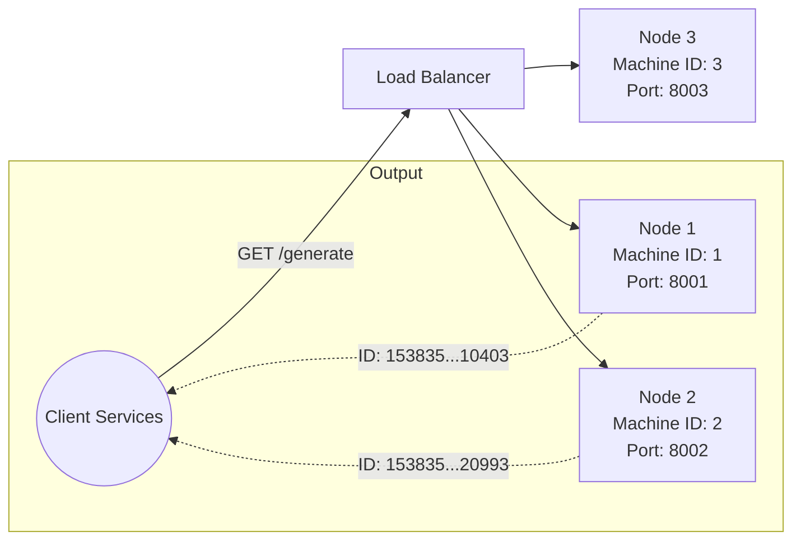

# Distributed Unique ID Generator (Snowflake)

A high-performance, distributed unique ID generation service built with **FastAPI**. It implements a Twitter Snowflake-inspired algorithm to generate 64-bit sortable integers locally without requiring coordination between nodes.

## High-Level Design (HLD)

### Architecture Overview

In distributed systems, traditional auto-incrementing databases create massive bottlenecks. To solve this, this decentralized architecture scales instantly by assigning a unique **Machine ID** to every node. Nodes then use bitwise operations and a local system clock to instantly generate completely unique, time-sortable identifiers on the fly. 



### Core Components

1. **Snowflake Algorithm Engine (`app/generator.py`)**:
   Generates a composite 64-bit integer broken into distinct bit segments:
   - **41 bits**: Timestamp offset in milliseconds from a custom defined `EPOCH`. (Provides ~69 years of capacity).
   - **10 bits**: Machine ID (Allows up to 1024 unique generator nodes globally without collisions).
   - **12 bits**: Sequence Number (Allows 4096 unique IDs to be generated *per millisecond* on a single node).
   - *Logic Structure*: Uses logical bit-shifting (e.g., `<< 22`) and the binary OR operation (`|`) to stitch these integers together efficiently.
   
2. **Clock Drift Tolerance & Fail-Safes**:
   - Uses `threading.Lock()` to ensure atomic sequencing out of parallel HTTP threads running on the same node.
   - Monitors the hardware clock. If the system experiences NTP drift and the clock moves *backwards*, the generator explicitly raises an exception to artificially pause generation, preventing fatal duplicate IDs from being emitted.

3. **FastAPI Interface (`app/main.py`)**:
   - Provides a fast, async HTTP frontend wrapping the algorithmic core.
   - Instantiates a persistent single instance of `SnowflakeGenerator` on boot.
   - Returns both a pure `int` (for backend services) and a deeply converted `id_str` (String) because modern web browsers (JavaScript) round off raw 64-bit integers and corrupt precision!

4. **Docker Network Layout (`docker-compose.yml`)**:
   - Statically defines three standalone instances of the generator.
   - Injects rigid Environment Variables guaranteeing each instance knows its unique `MACHINE_ID` boundary.

## Quick Start & Testing

### 1. Start the Cluster
Spin up all 3 distinct generator nodes utilizing Docker Compose:
```bash
docker-compose up -d --build
```

### 2. Verify Node Configuration
Ensure that the nodes booted up and mapped their unique configurations:
```bash
# Check Node 1 status
curl http://localhost:8001/health 
```

### 3. Generate IDs
Send a fetch request to any active node. The IDs produced across all nodes are guaranteed permanently unique and sortable.
```bash
# Fetch from Node 1
curl http://localhost:8001/generate

# Fetch from Node 2
curl http://localhost:8002/generate
```

*Output Example:*
```json
{
  "id": 128362438812676096,
  "id_str": "128362438812676096",
  "machine_id": 1
}
```